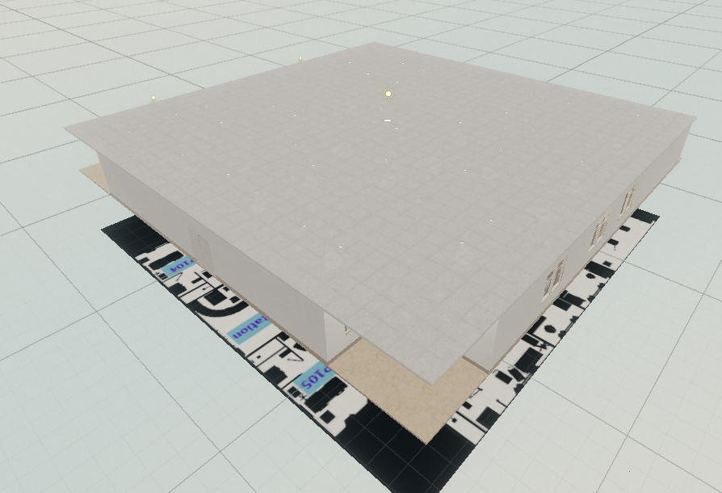
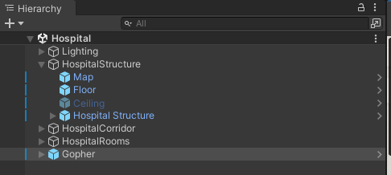
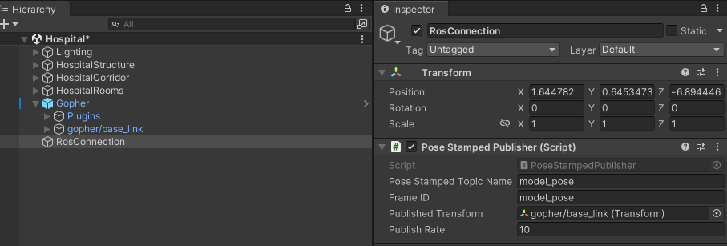
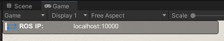

Install
================================================
The Gopher In Unity Simulation consists of two componants, the Unity enviornment, and the ROS code.

Dependencies
----------------
This repository has been developed and tested in Ubuntu 18.04 and ROS Melodic, with the Unity 2020.3 LTS.

Before running this package, it is highly recommended to go through the tutorial of `Unity Robotics Hub <https://github.com/Unity-Technologies/Unity-Robotics-Hub>`_ demo first. They provided a very detailed instruction to set up a robot arm in Unity. 
Also, you should try this `tutorial on how to set up a mobile robot <https://github.com/ZhuoyunZhong/Mobile-Robot-Demo-with-Unity-ROS>`_. The second tutorial provides more robot sensors and ROS publishers and subscribers examples. After these two tutorials, you should be able to understand how to set up a robot in Unity and how to communicate between ROS and Unity.

Unity Install
----------------
Download and install the proper Unity version via Unity Hub. In the folder for your unity project, git clone this repository for Unity simulation.

.. code:: sh

    cd <Unity_Path>/Unity/Projects
    git clone git@github.com:hiro-wpi/Gopher-In-Unity-Simulation.git

Unity Setup
----------------
Open Unity Hub and in the Projects tab, select ADD to add the "Gopher-In-Unity-Simulation" folder. Select Unity version to be 2022.3 and open the project. It is normal for the project to take a long time to run when opened for the first time.

After launching the project, please navigate to the **Scenes** folder and open the Hospital scene.

At this point the a map similar to that above should be visible in the **Scene View**.

ROS Install
----------------
.. code:: sh

    cd ~/catkin_ws/src
    git clone --recurse-submodules git@github.com:hiro-wpi/Gopher-ROS-Unity.git
    cd ..
    catkin_make

Quick Start
----------------

Finally, to validate both instalations, run a basic simulation using the Gopher bot.

Unity
^^^^^^^^^^^^^^^^

Nagivate to the **Prefabs** folder and drag an instance of **Gopher** into the top level of the **Hiearchy** pane as shown below.

Next create, in order to varify our connection we will create a simple model publisher. 

1. Create a **Empty Game Object** in the top level of the **Hiearchy** pane named `RosConnection`

2. Add a `PoseStampedPublisher` script to the componant

3. Drag the `gopher/baselink` object (a child of the gopher prefab) to the **Published Transform** field of the `PoseStampedPublisher` componant. 

The completed configuration should apear as below.

.. note::
   The above aproach is purley for quickly validating the setup. It is not recomended to use the  `PoseStampedPublisher` for Robot links, as this should be handled in the TF tree.

Finally navigate to **Robotics>ROS Settings** and ensure your **ROS IP Address** and **ROS Port** are correct.

ROS
^^^^^^^^^^^^^^^^
Ensure all the relevant ROS workspaces are sourced and then run the following launch command.

.. code:: sh

    roslaunch gopher_endpoint server.launch

Validation
^^^^^^^^^^^^^^^^

With the **gopher_endpoint** server running, you may now start the unity project. If a connection is established, you will see blue arrows in the **Game** pane as shown below.

In a terminal connected to your **ROS Master** run the following command to echo the created model topic.

.. code:: sh

    rostopic echo model_pose

Finally in the Unity **Game** pane, drive the robot base via the Arrow Keys. If you see the position update in the echoed topic you have successfully validated your setup.
